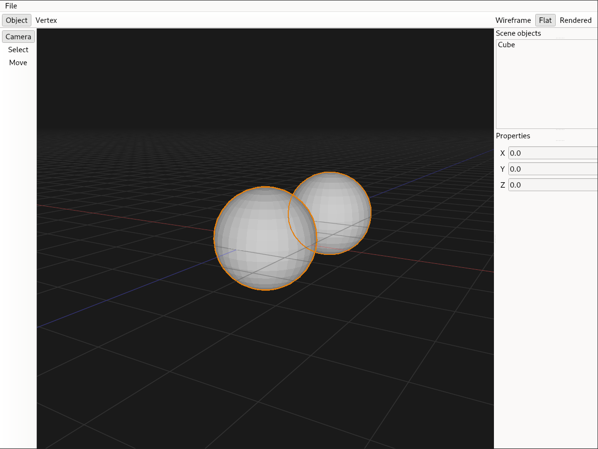
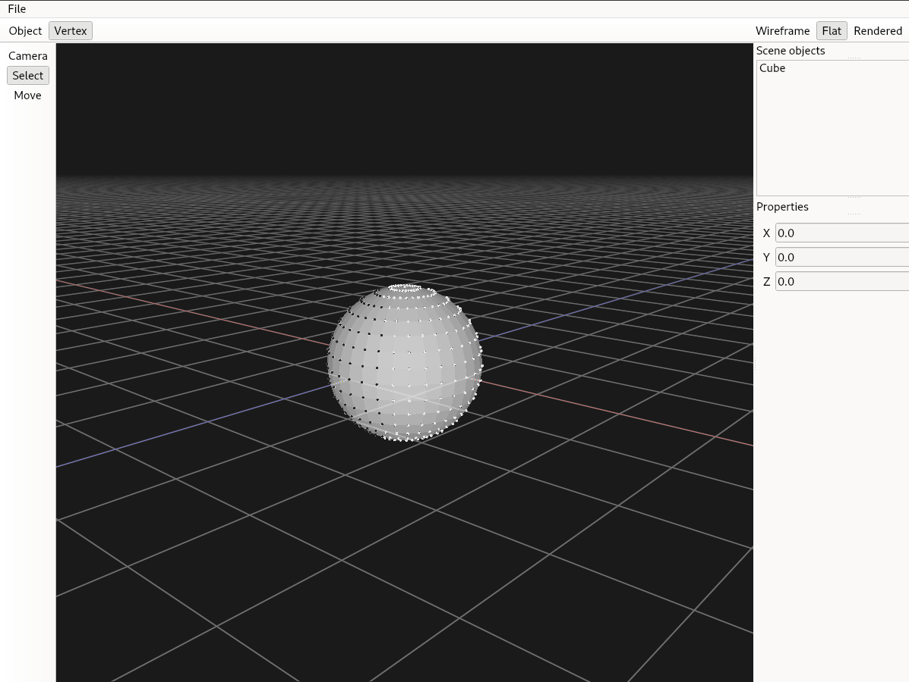

# Mixer: A Blender clone




## Build

To build with CMake:

```bash
git clone --recursive https://github.com/MahmoudHamdy02/mixer
cd mixer
mkdir build && cd build
cmake -DCMAKE_BUILD_TYPE=Debug ..
cmake --build .
```

Note: On Windows you might need to use `windeployqt` or manually copy some needed dlls next to the `.exe`, including `qwindowsd.dll` in a `platforms/` folder next to it.

## Dependencies

- Qt 6
- OpenGL 4.1+

The Polygon Mesh Processing (PMP) library source code is included as a git submodule in `external/`

## Architecture

The application is split up into three main layers: **UI**, **Renderer** and **Core**, alongside **Application** which handles state management.

### UI:

Built with Qt, includes the main OpenGL widget and other toolbars

### Renderer:

Handles OpenGL buffer management and different rendering modes

### Core:

Handles mesh data and geometry operations for all the objects in the scene

## Testing

After building, each test file will be compiled to an executable in the `build/tests` folder that can be run separately.

To run all tests:

```bash
cd tests
ctest
```

## Future Plans:

- Geometry operations such as extrude and bevel
- Use BVH structure or similar
- Offline software raytracer
- Advanced lighting
- Textures and materials
