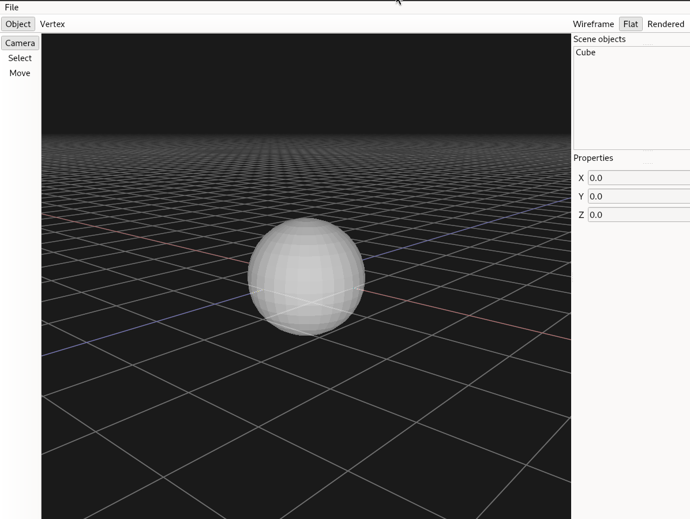

# Mixer: A Blender clone




## Build

To build with CMake:

```bash
mkdir build && cd build
cmake -DCMAKE_BUILD_TYPE=Debug ..
cmake --build .
```

Note: On Windows you might need to manually copy some needed dlls next to the `.exe`, including `qwindowsd.dll` in a `platforms/` folder next to it.

## Dependencies

- Qt 6
- OpenGL 4.1+

The Polygon Mesh Processing (PMP) library source code is included in `external/`

## Architecture

The application is split up into three layers: **UI**, **Renderer** and **Core**

### UI:

Build with Qt, includes the main OpenGL widget and other toolbars

### Renderer:

Handles OpenGL buffer management and different rendering modes

### Core:

Contains the mesh data for all the objects in the scene

## Future Plans:

- Geometry operations such as extrude and bevel
- Use BVH structure or similar
- Offline software raytracer
- Advanced lighting
- Textures and materials
